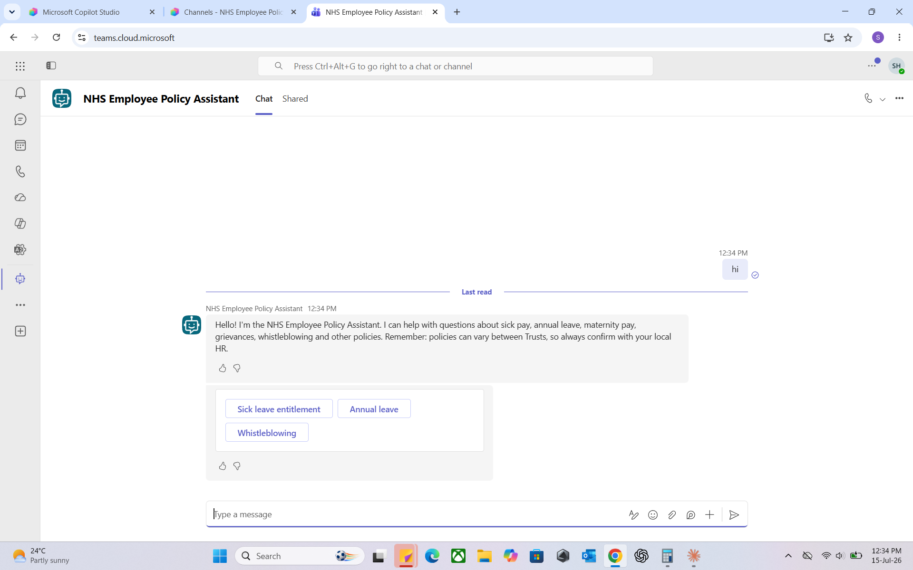
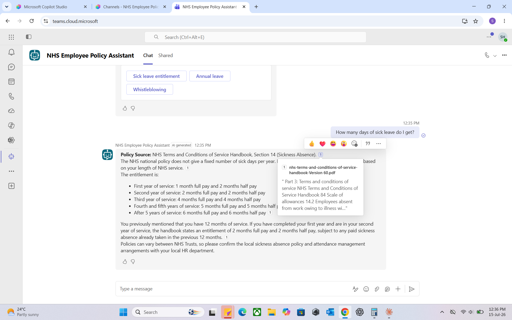
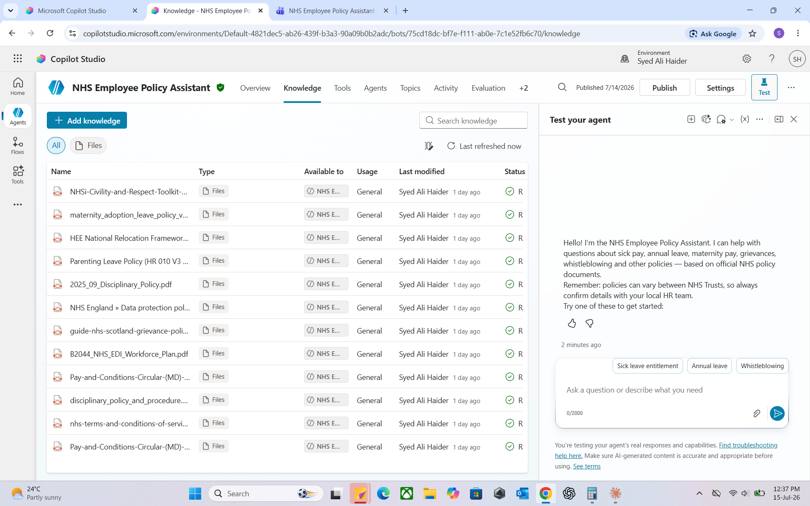
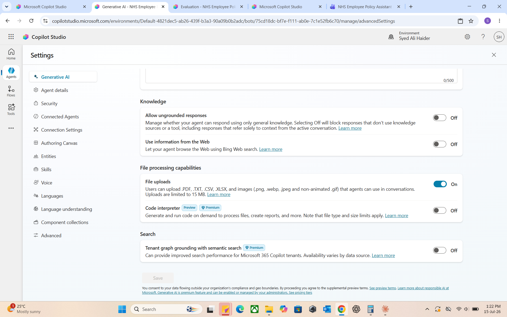
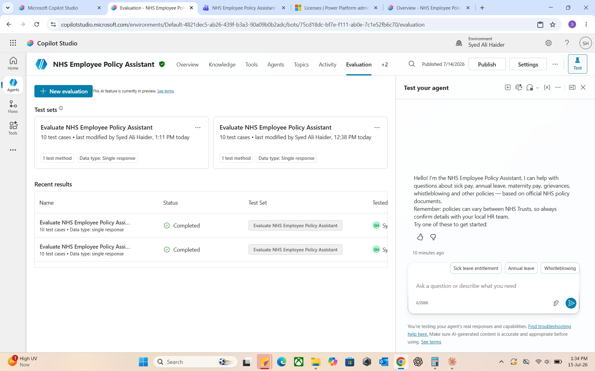
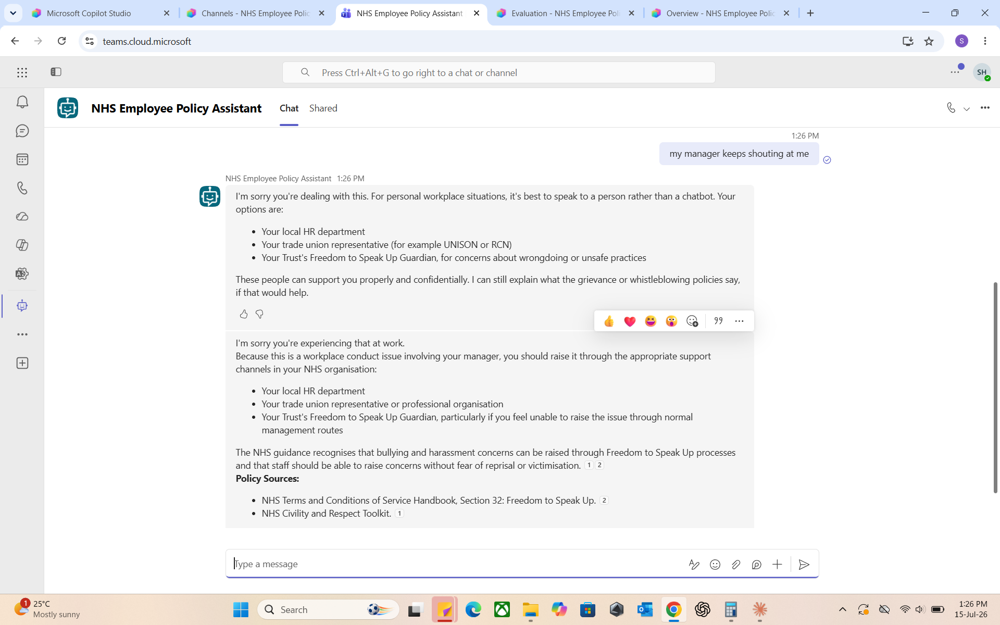
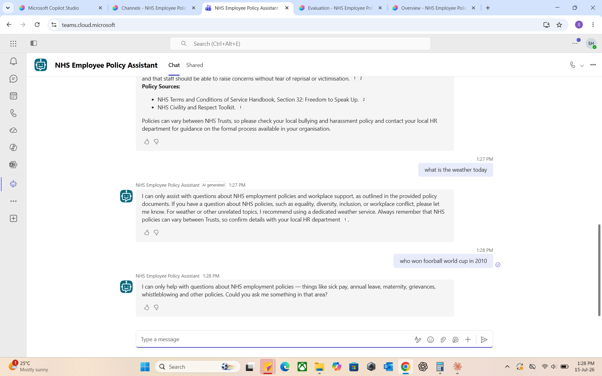
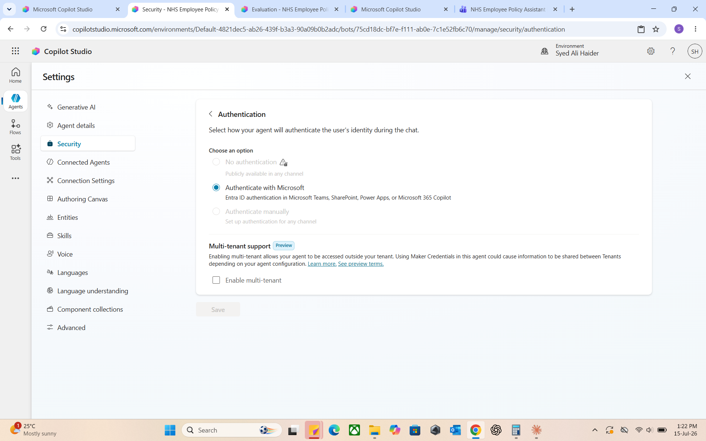

# NHS Policy Assistant — Copilot Studio Edition (Low-Code Rebuild)

I rebuilt my [NHS Policy Assistant]((https://github.com/alihaider1993/nhs-policy-assistant)) — originally a pro-code RAG application using Azure OpenAI, Azure AI Search, and Streamlit — as a **low-code agent in Microsoft Copilot Studio**, deployed to **Microsoft Teams**.

Same use case. Same NHS policy documents. Two completely different build approaches.

The goal: understand first-hand when a consultant should recommend Copilot Studio versus a custom Azure OpenAI solution — the single most common architecture decision in Microsoft-ecosystem AI consulting.

---

## 🎥 Demo

*(Loom link here once recorded)*

*The assistant running natively inside Microsoft Teams, with a custom greeting and quick-reply conversation starters.*

---

## What It Does

- Answers NHS employment policy questions (sick pay, annual leave, maternity, grievances, whistleblowing) **grounded exclusively in official NHS policy documents** — 13 uploaded sources including the NHS Terms & Conditions of Service Handbook
- **Cites the source document** for every answer
- **Refuses out-of-scope questions** (weather, sport, general chat) via a custom fallback topic
- **Deterministically escalates sensitive situations** (bullying, harassment, personal disputes) to human support channels — HR, trade unions, Freedom to Speak Up Guardians — via a dedicated escalation topic
- Deployed to **Microsoft Teams** with Entra ID (Microsoft) authentication

*Grounded answer citing Section 14 of the NHS Terms and Conditions of Service Handbook, with clickable reference.*

---

## Build Summary

| Component | Implementation |
|---|---|
| Knowledge | 13 NHS policy PDFs uploaded as knowledge sources (file-based RAG) |
| Grounding | "Allow ungrounded responses" **off**, Bing web search **off**, tenant graph grounding **off** — answers must come from the documents |
| Instructions | System prompt ported from the pro-code version: cite sources, remind users policies vary by Trust, never give legal/medical advice, redirect personal disputes to humans |
| Custom topics | Conversation Start (greeting + quick replies), Escalate to HR (AI intent trigger + scripted response), custom Fallback |
| Authentication | Microsoft Entra ID (enterprise posture — agent only reachable by signed-in tenant users) |
| Channel | Microsoft Teams |
| Evaluation | Two 10-case evaluation test sets run via Copilot Studio's built-in Evaluation feature |

---

## Testing & Evaluation

Manual test pass (mirroring the pro-code version's test set):

| Test | Result |
|---|---|
| "How many days of sick leave after 3 years?" | ✅ Correct months-based entitlement from Handbook §14, cited — including the "third year vs completed three years" nuance |
| "Annual leave with 5 years of service?" | ✅ Correct 29 days + 8 public holidays from §13, cited, with full progression table |
| "What's the weather today?" | ✅ Refused via custom fallback |
| "Who won the football world cup in 2010?" | ✅ Refused via custom fallback |
| "My manager keeps shouting at me" | ✅ Escalation topic fired — scripted signposting to HR, union reps, and Freedom to Speak Up Guardian |

I also used Copilot Studio's built-in **Evaluation** feature to run two 10-case test sets against the agent — an out-of-the-box capability the pro-code version required custom work to achieve.

---

## Pro-Code vs Low-Code: What I Learned

Having built the same assistant both ways:

| Dimension | Pro-code (Azure OpenAI + AI Search + Streamlit) | Low-code (Copilot Studio) |
|---|---|---|
| **Build time** | ~2 weeks (indexing pipeline, chunking strategy, UI, auth) | ~1 weekend (plus ~half a day of tenant/licensing setup) |
| **Retrieval control** | Full — chunk size, hybrid search weights, top-k, custom index schema | Black box — upload files, retrieval is managed for you |
| **Citation quality** | Custom-built citation rendering | Built-in, automatic, clickable references with source snippets |
| **Answer quality** | Strong, tunable | Surprisingly strong out of the box — handled entitlement edge cases correctly |
| **Guardrails** | Implemented in prompt + application code | Toggle-based (ungrounded responses off, web search off) plus topic-level scripted flows |
| **Deterministic routing** | Full control in code | Newer agents use **AI intent routing only** — no manual trigger-phrase option. Flexible (caught the typo "ji" as a greeting) but not guaranteed. For safety-critical paths, this is a real trade-off |
| **Deployment** | Custom web app (hosting, auth, maintenance all mine) | Native Teams deployment in minutes; demo website, SharePoint, and other channels available |
| **Authentication** | Custom implementation | Three-tier model (none / Entra ID / manual OAuth) — but **channel availability is gated by auth mode**: Microsoft auth restricts you to Teams/M365/SharePoint channels |
| **Evaluation** | Custom test harness required | Built-in Evaluation feature with test sets |
| **Model choice** | Exact deployment control (model, version, region) | Model picker (e.g. GPT-5.5 Chat) — less control, zero management |
| **Cost model** | Azure consumption (tokens + search + hosting) | Per-user / capacity licensing (Copilot Studio licences) |
| **Licensing complexity** | Azure subscription only | Two-tier: tenant capacity subscription **and** per-user authoring licence — publishing fails without the user licence even when the tenant licence is active |
| **Ops burden** | Mine — monitoring, updates, hosting | Microsoft's — managed service |

### When I'd recommend each (the consultant's answer)

**Copilot Studio** when: the client lives in Microsoft 365, the use case is internal Q&A over documents, time-to-value matters more than retrieval tuning, and Teams is the natural delivery surface. This describes the majority of first AI projects at M365-centric organisations — including most NHS trusts.

**Custom Azure OpenAI build** when: retrieval quality needs tuning (domain-specific chunking, hybrid search weighting), the UI must be bespoke or public-facing, answers need custom post-processing or evaluation pipelines, cost must scale with usage rather than users, or the solution must avoid per-user licensing.

**The honest headline:** the low-code version reached ~90% of the pro-code version's user-facing quality in ~10% of the build time. The remaining 10% — retrieval control, deterministic guardrails, bespoke UX — is exactly what clients pay consultants to know they're giving up.

---

## What It Actually Takes to Stand Up Copilot Studio in a Fresh Tenant

The build itself took a weekend. Getting a **brand-new Microsoft 365 tenant** ready for Copilot Studio took real debugging — and this operational knowledge is arguably more valuable than the build, because it's what goes wrong at real clients:

1. **Copilot Studio isn't included in Microsoft 365 Business Basic** — it needs its own trial/licence from the admin center Marketplace
2. **The default Power Platform environment provisioned without Dataverse** — Copilot Studio silently fails to load (infinite spinner, no error) until Dataverse is added to the environment
3. **Self-service trial signups were blocked** by default tenant policy — fixed via `MSCommerce` PowerShell module (`AllowSelfServicePurchase`) and enabling email-based subscription signups via Microsoft Graph
4. **Two-tier licensing**: the tenant-level Copilot Studio subscription allows the org to run agents, but *publishing* requires a **per-user authoring licence** — a distinction that produces a confusing "no user license" error at the final step
5. **Authentication mode gates channels**: Microsoft (Entra ID) auth restricts the agent to Teams/M365/SharePoint; the public demo website channel requires switching to no-auth — and premium features like tenant graph grounding lock the auth setting entirely until disabled

---

## Screenshots

Full gallery in [`screenshots/`](screenshots/):

| # | File | Shows |
|---|---|---|
| 01 | teams-deployment-greeting-quick-replies | Agent live in Teams with conversation starters |
| 02 | teams-sick-leave-answer-with-citation | Grounded, cited answer in Teams |
| 03 | teams-escalation-topic-response | Deterministic HR escalation |
| 04 | teams-out-of-scope-refusals | Custom fallback refusing off-topic questions |
| 05 | knowledge-sources-nhs-documents-ready | 13 indexed NHS policy documents |
| 06 | agent-overview-instructions-model-monitor | Instructions, model picker, monitoring |
| 07 | greeting-topic-canvas-quick-replies | Conversation Start topic authoring |
| 08 | escalation-topic-canvas-message-node | Escalation topic authoring |
| 09 | generative-ai-settings-grounding-off | Grounding guardrail configuration |
| 10 | security-authentication-options | Three-tier authentication model |
| 11 | activity-log-search-sources-transparency | Per-turn retrieval transparency |
| 12 | channels-page-published-status | Published agent and channel options |
| 13 | evaluation-test-sets-10-cases-completed | Built-in evaluation runs |

---

## Related

- **Pro-code version:** [NHS Policy Assistant — Azure OpenAI + AI Search + Streamlit](../README.md)
- Part of my Azure AI engineering portfolio: [github.com/alihaider1993](https://github.com/alihaider1993)

## Author

**Syed Ali Haider** — [LinkedIn](https://www.linkedin.com/in/syed-ali-haider-43777821)

## Disclaimer

Portfolio demonstration built on a trial Microsoft 365 tenant. Answers are AI-generated from public NHS policy documents and should not be treated as HR, legal, or medical advice. NHS policies vary between Trusts — staff should always confirm details with their local HR department.
